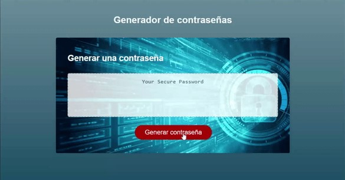

# Generador de Contraseñas - Desafío 3

## En este tercer desafío se ha creado un generador de contraseñas que cumple con los siguientes criterios de aceptación:

CONSIDERANDO que necesito una nueva contraseña segura  
CUANDO hago click en el botón para generar una contraseña  
ENTONCES me proporcionan una serie de "prompts" con opciones para generar la contraseña  
CUANDO me presentan las opciones para generar la contraseña  
ENTONCES selecciono qué requisitos incluir en la contraseña  
CUANDO me presentan la opcion para la longitud de la contraseña  
ENTONCES selecciono una longitud de al menos 8 caracteres y no más de 128 caracteres  
CUANDO me presentan las opciones sobre qué tipos de caracteres incluir en la contraseña  
ENTONCES confirmo si incluir o no incluir letras minúsculas o mayúsculas, números y/o caracteres especiales  
CUANDO confirmo cada "prompt"  
ENTONCES la información proporcionada debe ser validada y al menos un tipo de caracter debe ser seleccionado  
CUANDO todos los "prompts" son respondidos  
ENTONCES se genera una contraseña que cumple con los requisitos seleccionados  
CUANDO se generó la contraseña  
ENTONCES la constraseña se muestra en una alerta o se escribe en la página  

## Se puede acceder a la aplicación por medio del siguiente link:

* [Link a aplicación]()

## La aplicación luce tal como se muestra en la siguiente imagen:

## A continuación se presenta una animación sobre el funcionamiento de la aplicación:

